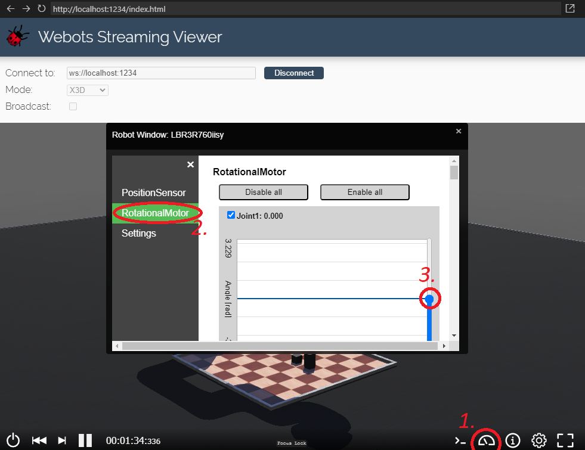

# Chess-Playing KUKA Robot (ROS 2 + Webots)

This repository contains the software stack for a KUKA LBR3R760iisy robot designed to play chess. The project combines the power of ROS 2's control system with a Webots simulation environment to create a chess-playing robot.


## Table of Contents
- [Introduction](#introduction)
- [Prerequisites](#prerequisites)
- [Installation](#installation)
- [Usage](#usage)
- [Contributing](#contributing)

## Introduction

Chess-Playing KUKA Robot is a ROS 2 project that demonstrates the capabilities of the [ros2_control](https://index.ros.org/p/ros2_control/) framework for robot control. It combines the control software with a Webots simulation environment to simulate and play chess.

Key components of this project:
- **board_manager ros2 package** The project has a board_manager package that listens via a REST api for moves. All the moves are validated via the `chess` pip package and then sent towards the motion planner. A move is finished after the robot actually places it on the target position. It also comes with a basic frontend that uses `pygame`.
- **motion_planner ros2 package**: The project uses the `moveit2` framework to calculate the inverse kinematics and the trajectories for the movement of the robot for chess piece manipulation.
- **controller ros2 package**: The project uses the `ros2_control` framework to define the robot's hardware interfaces and controllers.
- **Webots Simulation**: The KUKA robot is simulated in the Webots environment, allowing it to interact with the chessboard and chess pieces.

## Prerequisites

Before you begin, ensure you have the following prerequisites:

- [ROS 2](https://index.ros.org/doc/ros2/Installation/): Install ROS 2 Humble according to your system's requirements.
- [Webots](https://cyberbotics.com/): Download and install Webots, as it's the simulation environment used for the project.
- A system with the necessary hardware requirements to run the simulation.

    Note: You can use the [install_dependencies.sh](install_dependencies.sh) script to install all the neccessary dependencies for Ubuntu. (TODO)

## Installation

To install and run the chess-playing robot, follow these steps:

1. Clone this repository:
   ```bash
   git clone https://github.com/PetoAdam/chessbot.git
   cd chessbot
   ```
2. Build the ros2 workspace:
    ```bash
    cd ROS2
    colcon build
    source install/setup.bash
    ```
    TODO: might need mixin for moveit

## Usage

To run the chess-playing robot, use the following commands in seperate terminals from the repository's root directory:
```bash
# Start the Webots simulation
cd Webots
python3 webots_launch.py default.wbt LBR3R760iisy

# Start ROS 2 control
cd ROS2
# make sure to have the ROS2 workspace built
source install/setup.bash
ros2 launch chessbot lbr3r760iisy_controller.launch.py

# TODO:
# Start inverse kinematics solver (MoveIt)

# Start the board_manager service
cd ROS2
# make sure to have the ROS2 workspace built
source install/setup.bash
ros2 run board_manager board_manager_service

# Start the frontend for chess
cd ROS2
python3 src/board_manager/board_manager/chess_gui.py
```

Note: Webots also has a streaming viewer option, which can be accessed on port 1234 of the machine running it. For example in the case of localhost: http://localhost:1234/index.html. If the computer running the simulation has no dedicated GPU, turning off rendering can drastically improve performance. To see what the robot does in the simulation, you can use the streaming feature from a different computer.

## Testing

The repository allows for manual testing of the services of the project separately.

### Simulation
The simulator has a streaming viewer that lets users manually move the robot. Make sure the ros2_control package is not running.
After starting the Webots simulation, open a browser and go to:
http://localhost:1234/index.html
Then connect to the simulation.
After you have successfully connected to the simulation, follow the tutorial on the picture below:

The positions of the joints can be adjusted by dragging the circles.

### ros2_control
To test the ros2_control, both the simulation and the ros2_control has to be running.
To test the arm movement, you can run this script from the ROS2/src/controller directory:
```
./trajectory.sh
```
It tests if your setup was successful and makes the robot move slightly right and left

To test the gripper movement:
```
ros2 topic pub /gripper_controller/gripper_command std_msgs/msg/Float64 "{data: 0.5}"
```
This should close the gripper.

### Motion planner

TODO

### Board Manager and Frontend
The board manager and the frontend can be tested completely separately from the other services, as there is a dummy motion planner, which simulates successful robot motion. To test it, run these scripts in separate terminals from the ROS2 directory (make sure that the ROS2 workspace is built, and sourced in every terminal):
```bash
ros2 run board_manager dummy_motion_planner
ros2 run board_manager board_manager_service
python3 src/board_manager/board_manager/chess_gui.py
```
When all the processes are started, you should be able to play chess on the frontend.

## Contributing

We welcome contributions to this project. If you find any issues or have suggestions for improvements, please create a GitHub issue or submit a pull request. We value your input!

---

Enjoy your chess-playing KUKA robot powered by ROS 2 and Webots! If you have any questions or need assistance, please don't hesitate to reach out to us.